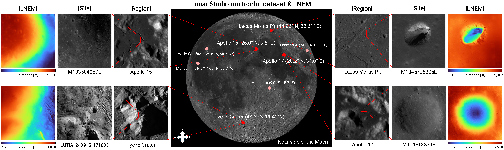
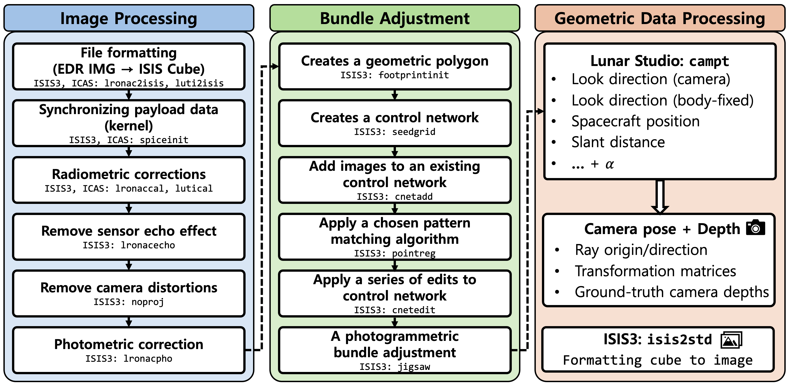

<h1>🌕 [CVPR 2026] LNEM: Lunar Neural Elevation Model</h1>

[**Suwan Lee**](https://view.kentech.ac.kr)1 · [**Jo Ryeong Yim**](https://www.kari.re.kr/eng)2 · [**Kibaek Park**](https://view.kentech.ac.kr)1 · [**Dong-Gyu Kim**](https://www.kari.re.kr/eng)2 · [**Eunhyeuk Kim**](https://www.kari.re.kr/eng)2 · [**Minsup Jeong**](https://www.kasi.re.kr)3 · [**Chae Kyung Sim**](https://www.kasi.re.kr)3 · [**Seokju Lee**](https://view.kentech.ac.kr)1†

1KENTECH &nbsp;&nbsp; 2KARI &nbsp;&nbsp; 3KASI

🚧 Code release coming soon.

  

---

## 🌕 Overview

We introduce **LNEM**, the first volumetric neural rendering framework for lunar DEM reconstruction that integrates Rigorous Sensor Models (RSMs) for pushbroom imagery, and **Lunar Studio**, a standardized multi-orbit dataset and pipeline built on LROC NAC and KPLO LUTI observations. By explicitly modeling per-line camera poses, multi-resolution hash encoding, and shadow-aware illumination, LNEM achieves **high-fidelity reconstruction** across diverse lunar terrain — outperforming neural baselines and complementing traditional DEM pipelines.

<!-- 

  

 -->

---
